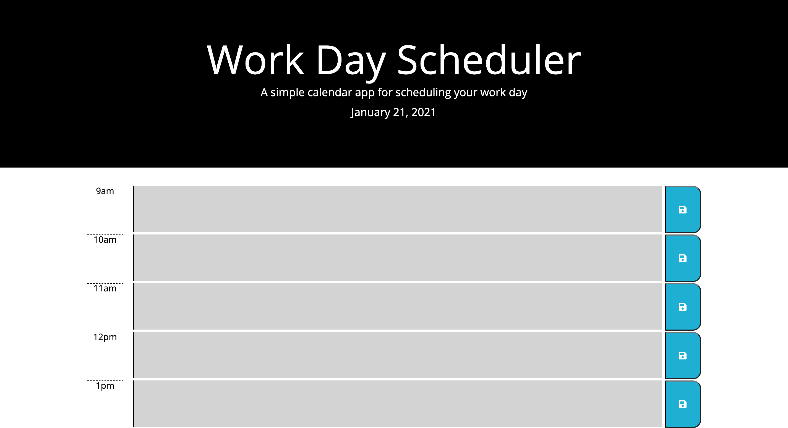

# 05 Third-Party APIs: Work Day Scheduler
---


## Work Day Scheduler
---
I Created a simple calendar application that allows a user to save events for each hour of the day. This app will run in the browser and feature dynamically updated HTML and CSS powered by jQuery.

## User Story
---
```
AS AN employee with a busy schedule
I WANT to add important events to a daily planner
SO THAT I can manage my time effectively
```


## Acceptance Criteria
---
```
GIVEN I am using a daily planner to create a schedule
WHEN I open the planner
THEN the current day is displayed at the top of the calendar
WHEN I scroll down
THEN I am presented with time blocks for standard business hours
WHEN I view the time blocks for that day
THEN each time block is color-coded to indicate whether it is in the past, present, or future
WHEN I click into a time block
THEN I can enter an event
WHEN I click the save button for that time block
THEN the text for that event is saved in local storage
WHEN I refresh the page
THEN the saved events persist
```
## Criteria Met
---
```
The Planner was created
When the planner was opened
Then the current day is displayed at the top of the calendar
When the user scrolls down
Then they are presented with time blocks for standard work day
When the user views each time block
Then each time block is color-coded to indicate whether it is in the past, present, or future
When the time block is clicked
Then the user can enter an event
When the save button is clicked for that block
Then the text is saved in local storage
When the page is refreshed
Then the saved events persist
```
## In Action
---


## Technologies Used
---
1.  HTML
2.  Javascript
3.  Bootstrap
4.  MomentJS
5.  Jquery
6.  CSS
7.  GoogleApis Fonts
8.  Font Awesome

## Issues 
---
I ran into very few issues, considering we had to build the javascript up completely and then modify our index in order to match the given stylesheet.

The main issue I ran into in this step was properly naming the classes and id's in order to make them memorable and readable to assign events and changes to later on in the week as my code progressed.

The color coding block actually came pretty naturally because of what we covered in class.  I also frequently relied upon the textbooks we were encouraged to check out for this bootcamp.  The textbook is called **Javascript & Jquery** *interactive front-end web development* by Jon Duckett.

Where I had some issues was when I began introducing the storage logic.  Having not used much of it there was a lot of trial and error and visits to the BCS help button.  Eventually I was able to traverse the dom and set storage where it needed to be

Another issue I had also had to do with the reload function.  I ran into a problem of which selector to use, a given id, or the data-value which I had assigned.  After much trial and error I resolved it by using data-value entry.  It was also nice to implement the each() methods in order to cycle through my selections without having to use a wordy for loop.  This brought about some challenges as to how to properly use the $(this).

## Links
---
### Github Repo
https://github.com/cmgson/Day-Planner
### Deployed Page
https://cmgson.github.io/Day-Planner


